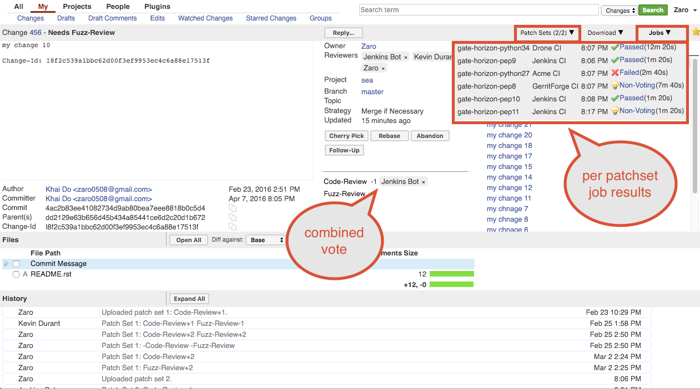

The @PLUGIN@ plugin seperates test results from comments.  It provides a
separate channel for Gerrit to store test metadata and view them on the
Gerrit UI.  The metadata can be stored in the Gerrit database or in a
completely separate datastore.

Typically a CI system, like [Jenkins], will post test metadata to Gerrit as a
comment.  It looks something like this..

```
Jenkins                     Aug 24 3:57 PM
Patch Set 5: Verified-1
Build Failed
http://jenkins.acme.com/job/python-27-wacko/4/ : FAILURE
http://jenkins.acme.com/job/python-27-pep8/6/ : SUCCESS
http://jenkins.acme.com/job/python-27/4/ : SUCCESS
..
```

The problem occurs when there are many jobs verifying each patchset.  An
increased number of reports from Jenkins can overwhelm reviewers who must look
through the comments and decipher which replies to pay attention to.  After a
while the CI reports become more like spam.  Usually human reviewers only
want to view comments that have been posted by other humans reviewers not bots.
Since humans and bots must share a communications (or comments) channel it's
difficult to separate the two competing pieces of data for the purposes of
reviewing, visualizations and even analytics.

This is where the @PLUGIN@ plugin comes in.  It creates a separate channel for
bots to report info to Gerrit.  It provides a separate database to store the
info and it provides a set of SSH commands and REST endpoints to save
and retrieve the data.  It also provides UI components to view the data
outside of the Gerrit comments.

### <a id="workflow"></a>
### `Workflow`

Any CI system can be used with the @PLUGIN@ plugin.

A typical workflow:
1. CI system triggers on a new patchset, ref update or comment.
2. CI system executes build jobs.
3. CI system reports test results with the @PLUGIN@
[ssh command](cmd-save.md) or [rest-api](rest-api-changes.md).
4. CI system reports a combined `Verified` vote based on the results of each job
using the [review ssh command](../../../Documentation/cmd-review.html) or
[review rest api](../../../Documentation/rest-api-changes.html#set-review).
5. Users can view per patch job results on Gerrit UI or retrieve the results
using the @PLUGIN@ rest api.

_NOTE_: The Jenkins [Gerrit verify status reporter plugin] documentation
contains specific instructions on setting up this workflow with the
Jenkins CI system.


### <a id="change-screen"></a>
### `Change Screen`
Visualized based on the [job results](#job-results) info




### <a id="job-results"></a>
### `Job Results`

The job score (or value) is the result from the executed build.  This
score is independent of the Gerrit label (i.e. `Verified`) score. The
reporter scores each build job and then (if given permission) scores the
combined Verified vote.

|Score          |Result  |
|:------------- |:-------|
|less than 0    |Failed  |
|0              |Unstable|
|greater than 0 |Passed  |


The information icon is an indicator that a job has abstained from voting
(or is a non-voting job).  Abstaining typically indicates that a job's
score may not factor into determining the combined vote.


### <a id="configure-panels"> @PLUGIN@ configure-panels

Configuration
-------------

The @PLUGIN@ job panels can be configured in the [gerrit.config]
(../../../Documentation/config-gerrit.html#_file_code_etc_gerrit_config_code)
file.

#### Parameters

|Field Name                    |Description|
|:-----------------------------|:----------|
|showJobsPanel                 | Whether jobs panel should be displayed (default to true)|
|showJobsDropDownPanel         | Whether jobs drop down panel should be displayed (default to true)|
|showJobsSummaryPanel          | Whether jobs summary panel should be displayed (default to true)|
|showJobsBelowRelatedInfoBlock | Whether jobs panel should be positioned below related info block (default to false)|
|sortJobsPanel                 | The order of jobs sorting on jobs panel (REPORTER,NAME,DATE default to REPORTER). Both upper and lower cases are allowed.|
|sortJobsDropDownPanel         | The order of jobs sorting on jobs drop down panel (REPORTER,NAME,DATE default to REPORTER). Both upper and lower cases are allowed.|


#### Example

```
[plugin "@PLUGIN@"]
   showJobsDropDownPanel = false
```


[Jenkins]: https://jenkins.io
[Gerrit verify status reporter plugin]: https://wiki.jenkins-ci.org/display/JENKINS/Gerrit+Verify+Status+Reporter+Plugin
