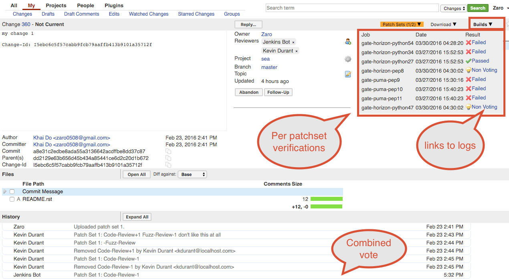

The @PLUGIN@ plugin allows CI system to report build and test results back to
Gerrit. The reports are stored per patchset and are saved onto an external
database.  Included with this plugin are a set of SSH and REST APIs to automate
the reporting of test results.  This plugin will also handle displaying of the
test results on the Gerrit UI.

### `Change Screen`
