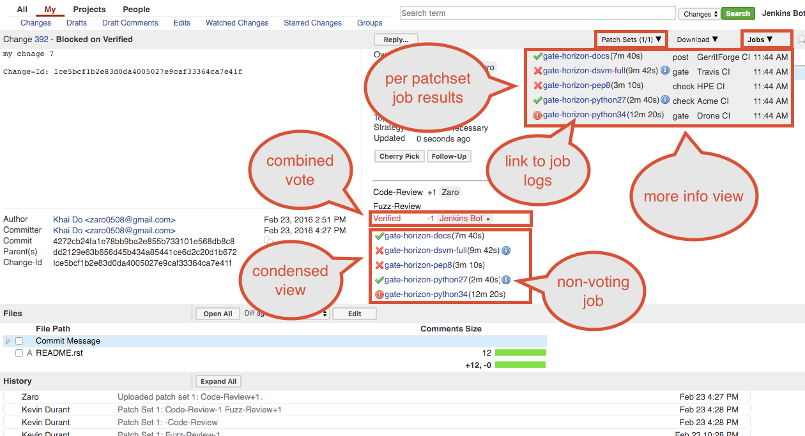

<link href="../com/googlesource/gerrit/plugins/verifystatus/public/verifystatus.css" rel="stylesheet"></link>

The @PLUGIN@ plugin allows CI system to report build and test results back to
Gerrit. The reports are stored per patchset and are saved onto an external
database.  Included with this plugin are a set of SSH and REST APIs to automate
the reporting of test results.  This plugin will also handle displaying of the
job results on the Gerrit UI.

### `Change Screen`
Visualized based on the [job results](#job-results) info

### JobResults
### `Job Results`

Job result scores represent the results from the executed build.  These
scores are independent of the Gerrit label (i.e. Verified) score. The
reporter is responsible for scoring each build job and (if given permission)
the combined Verified vote.

The result info ('Passed', 'Failed', 'Experimental', etc..) comes from the
comment of each job.